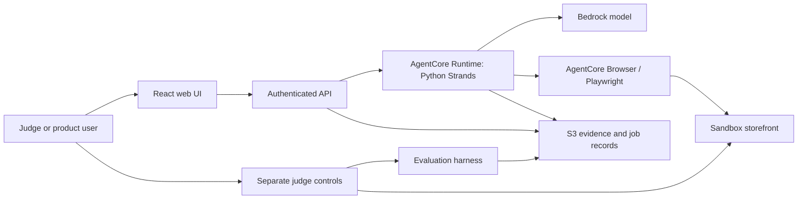

# SignalCase — Technical Specification

Revision 1, 2026-09-12. Planning baseline for four remote contributors. Approved product direction; architecture details here are implementation proposals. No application exists yet.

## Product and scope

**Primary user:** Product/support engineer at a small software team. **Job:** Convert customer complaints into an actionable investigation without manually reconstructing and testing every report.

**MVP:** Paste or upload text/JSON conversations, group related claims preserving sources, consult supplied docs and issue records, investigate a controlled web store, and deliver a reviewable evidence report. Process groups sequentially. One report per investigated group.

**Out of scope:** Arbitrary public websites, production credentials/data, automatic code fixes, medical use, feature prioritisation, full support-platform integration, automatic ticket creation, model training, vector database, multi-agent swarm, long-term AI memory. Markdown/JSON issue export is sufficient.

## Architecture

The control plane and evaluator know faults; the agent does not. The sandbox backend shares infrastructure only if credentials/routes still enforce this separation. Hiding a button in the UI is insufficient.

### Technology decisions

- Strands Python is required project foundation; Python 3.12 is the proposed baseline, subject to installed SDK compatibility in T0.
- React + TypeScript + Vite for a static UI; Node 22 and npm lockfile proposed for reproducibility.
- Bedrock tool-capable model; model ID and AWS region configured after access, quality and price verification in T0. No model choice is claimed tested.
- AgentCore Runtime for hosted agent execution; AgentCore Browser plus Playwright for browsing. Local Playwright adapter for development.
- S3 for immutable evidence, job snapshots and reports. Local filesystem adapter for offline development. No DynamoDB in MVP.
- Small Python HTTP API. Hosting decision isolated in docs/DEPLOYMENT.md. Amplify excluded.
- Pydantic validates structured records; JSON Schema is wire-contract authority. pytest and Playwright for checks. CI never needs AWS credentials for baseline tests.

## Investigation lifecycle

1. API validates a bounded input and creates workspace-scoped conversation records.
2. Agent groups related complaints; every original conversation remains traceable. Distinct claims in one conversation may belong to different groups.
3. For each selected group, retrieve supplied docs/issues. Preserve reported sequence, prerequisites and unknowns.
4. Form a hypothesis of observable behaviour; interact with ordinary storefront UI through bounded tools.
5. Record actions, DOM observations and screenshots. Compare monetary values with code and documented rules.
6. Attempt the relevant sequence again in a fresh seeded cart/session when possible. One occurrence may be reported as reproduced with repeatability explicitly limited; never claim repeatable without repeats.
7. Validate report structure, evidence references, expected-behaviour sources and status semantics.
8. Persist final report and metrics before marking job completed. Human reviews and exports it.

Job states: queued → running → completed | failed | cancelled. An investigation report separately has reproduced | not_reproduced | blocked. A completed job may contain a blocked report; an infrastructure failure is a failed job. A stale running job becomes failed with code WORKER_LOST after its deadline is exceeded; polling must never hang indefinitely.

## Tool boundaries

Tools: search_documents(query), search_existing_issues(query), inspect_page(), navigate(url), click(target), fill(target,value), capture_evidence(label), calculate_discount(subtotal_minor,percent), finalize_report(report).

Targets are observed accessible roles/names or validated element references, not invented coordinates. Tool responses carry evidence IDs where applicable. No generic shell tool, unrestricted fetch, source-code browser or control-panel API. Reset for repeatability is provided by the orchestrator as a constrained fresh ordinary session; no fault-changing permission is exposed.

Limits: input ≤ 100 conversations / 1 MiB total; each message ≤ 10,000 characters; investigate ≤ 3 groups per request; 60 browser actions and 30 model calls per group; 180 seconds per group with a 600-second job deadline. These are initial engineering limits, not measured performance promises. Report when a limit prevents conclusion. Reviewer testing must remain available; controls must not impose arbitrary judge run quotas.

## Evidence and report correctness

Each screenshot/action/DOM excerpt has a UUID, run/workspace association, creation time, content hash and private storage key. URLs delivered to users are short-lived signed links generated only after workspace authorization. Store actions and observations, not private model chain-of-thought. Reports cite customer source IDs and document evidence separately.

Issue interpretation: observed_defect | possible_feature_gap | documented_behavior | unresolved. Reproducing a visible behaviour does not itself prove it violates a requirement. Root cause is outside the MVP unless direct evidence supports it, and must be labelled hypothesis otherwise.

Duplicate candidates cite existing issue IDs with a similarity explanation; never silently discard a complaint or use phrase similarity as proof of the same defect.

## Security and isolation

Workspace-scoped access tokens are separate from agent sandbox credentials. Judge control tokens never enter model context, browser storage or agent environment. Each storefront workspace has its own cart/orders and fault state. Agent permissions access only ordinary storefront routes for that workspace. Tests must attempt direct administrative URL access.

Allow only configured sandbox origins; validate redirects and block unauthorized destinations. Browser downloads disabled. Uploads are text/JSON only. No real payment processing. Logs redact tokens, cookies and authorization headers. Store private artifacts encrypted using provider defaults; retention through judging, then explicit team cleanup. Delete must cover artifacts and records, not merely hide UI rows.

## Reliability and concurrency

One active job per workspace; additional launches return 409. The API creates the active marker with conditional storage write; no check-then-write race. One runtime writer owns its job snapshot. Immutable sequenced event objects avoid concurrent JSON appends. Repeated launch with the same idempotency key returns the original job; reused key with different payload returns 409.

Runtime registers background processing using supported AgentCore lifecycle methods and returns promptly. Completion unregisters tasks in a finally block. Browser sessions close on success, failure and cancellation. Browser refresh only resumes polling; it never restarts a job. Partial evidence survives errors. No automatic blind rerun of a cart mutation after an ambiguous tool response; inspect state first.

## Acceptance and definition of done

A judge can create a workspace, configure a fault privately, supply their own complaint, observe actual browser work, inspect citations, reproduce the behaviour manually, and rerun after disabling the fault. Local fixture tests, cloud smoke test, isolation tests and complete hosted journey pass. Measured latency/cost and failed scenarios are published. See docs/JUDGE_TESTING.md for the evaluation matrix.
